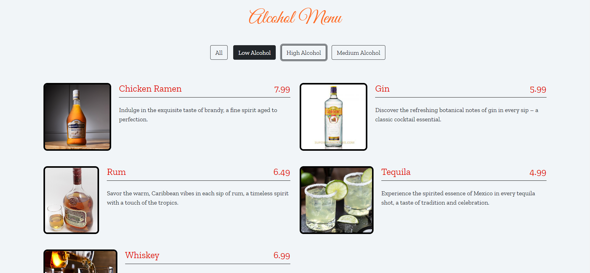

# Alkol Menüsü

Bu alkol menüsü web uygulaması, kullanıcının farklı kategorilere ayrılmış alkollü içecekleri görmesine ve seçtiği kategoriye göre menüyü filtrelemesine olanak tanır.

## Kullanım

1. Projeyi bilgisayarınıza klonlayın.

    ```bash
    git clone https://github.com/josephnade/alkol-menu.git
    cd alkol-menu
    ```

2. Proje dizininde bulunan `index.html` dosyasını bir tarayıcıda açarak projeyi görüntüleyin.

3. Sayfa üzerinde üç kategori butonu bulunmaktadır: "Hafif Alkol", "Orta Alkol" ve "Ağır Alkol". Ayrıca "Hepsi" butonu, tüm içecekleri göstermek için kullanılır.

4. İçecekler, her biri için bir fotoğraf, fiyat ve başlık içeren kartlarda listelenir.

5. Kategori butonlarına tıkladığınızda, sadece seçilen kategoriye ait içecekler görüntülenir.

6. Sayfayı yenilediğinizde, seçili kategori ve içecekler localStorage üzerinde saklanarak sayfa üzerinde tutulur.

## Özellikler

- Farklı kategorilere ayrılmış alkollü içecekleri görebilirsiniz.
- Kategori butonlarına tıklayarak menüyü filtreleyebilirsiniz.
- Menüdeki içeceklerin her biri için fotoğraf, fiyat ve başlık bulunmaktadır.
- Seçili kategori ve içecekler localStorage üzerinde saklanır, böylece sayfayı yenilediğinizde veriler kaybolmaz.

## Ekran Görüntüsü



## Teknolojiler

- HTML
- CSS
- JavaScript

## Katkıda Bulunma

Her türlü katkı ve geri bildirimlere açığım. Sorularınız veya önerileriniz varsa lütfen [iletişime geçin](mailto:yusuf.akn2017@gmail.com).

---

Umarım bu dokümantasyon, projenizi kullanmak ve anlamak konusunda size yardımcı olur. Keyifli içkiler! 🍹
